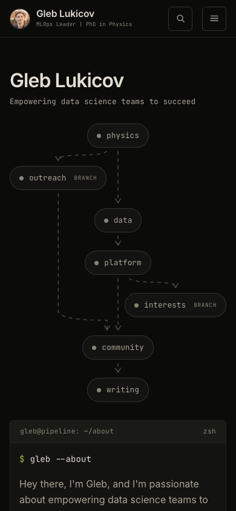
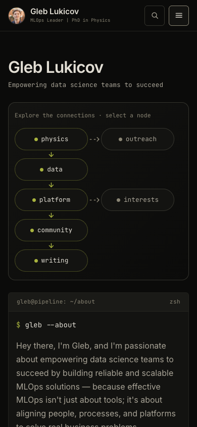
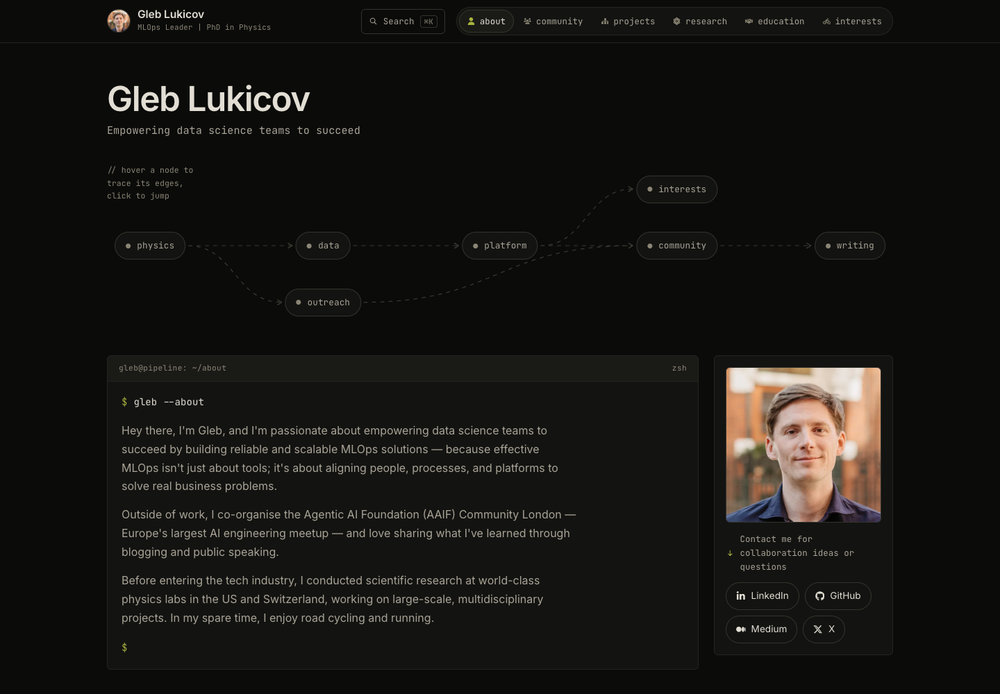
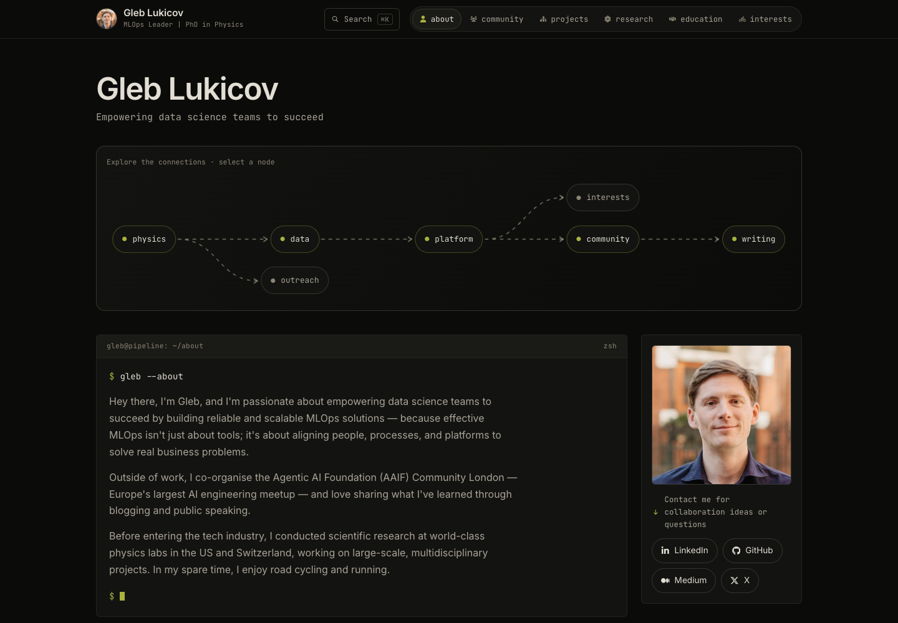

# Mobile pipeline refinement

Live-site baseline and local proposal captured on 5 September 2026.
The proposal keeps the existing pipeline identity, all seven destinations,
and six connections. GitHub Pages still deploys from `master`.

## Mobile — 390 × 844

| Live site | Proposed |
| --- | --- |
|  |  |

The five main nodes share one vertical column; branches sit beside their
source nodes. Outreach and interests terminate as independent branches.
Solid moss connectors distinguish the main path
from dashed branches. Every node has a minimum 44px touch target.

At 390px, the graph including its new frame and instruction is 352px high
(previously 460px, a 23% reduction). The introduction begins at 578px rather
than 694px. The narrow header also wraps the role instead of clipping it
behind the search button at 320px.

## Desktop — 1440 × 1000

| Live site | Proposed |
| --- | --- |
|  |  |

The horizontal graph gains a subtle frame, brighter connectors, a clearer
main path, and an instruction that also makes sense on touch devices.

## Animation and validation

The previous loop could accumulate one extra requestAnimationFrame chain
per relayout. The graph now cancels its pending frame, retains viewport
visibility, pauses in hidden tabs, and responds to reduced-motion changes.
Motion uses elapsed time so its speed does not depend on screen refresh rate.

- `node --test tests/dag-animation.test.cjs`: four lifecycle regressions pass.
- Strict HTML5 parsing, unique IDs, internal anchors, and inline/external
  JavaScript syntax pass. Link, image, and iframe destinations match master.
- Browser geometry checks: 320, 375, 390, 430, 768, 859, 860, 1024, 1440px;
  no node clipping, overlaps, or page overflow at these widths.
- Browser interaction checks: keyboard focus, platform anchor, menu,
  command palette, reduced motion, and working links without JavaScript.
- All six live lazy embeds and existing WebP assets remain intact. LinkedIn
  emitted intermittent third-party HTTP failures during browser checks.
- No repository-native lint, format, type-check, or completion-hook setup
  exists. JS syntax and whitespace checks pass; the new test is Prettier
  clean. The existing HTML fails default Prettier on both master and this
  branch; a whole-page formatting rewrite is outside this change.

Screenshots are review artifacts and are not loaded by the homepage.
